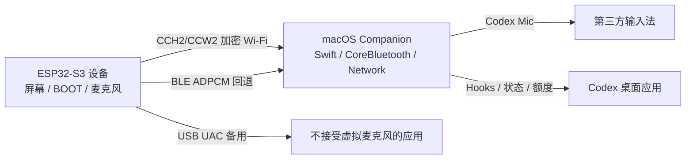

# ESP32-S3 Codex Companion

[](https://github.com/qq654704712/esp32-codex-companion/actions/workflows/ci.yml)
[](LICENSE)

一个面向 [Waveshare ESP32-S3-Touch-LCD-1.85B](https://www.waveshare.com/esp32-s3-touch-lcd-1.85b.htm) 的开源桌面伴侣：设备负责实体按键、屏幕、音频采集和连接状态，macOS Companion 负责把无线音频接入标准输入设备，并把 Codex 任务状态、审批和额度显示到设备上。

> 项目状态：**可供开发者试用，硬件验收仍在持续进行**。它是独立社区项目，不隶属于 OpenAI、Waveshare 或任何输入法厂商。

## 能做什么

| 能力 | 说明 |
| --- | --- |
| 无线 PTT 语音 | 长按设备 BOOT 采集语音，经 Wi-Fi 加密 UDP 传到 Mac；Wi-Fi 不可用时下一次 PTT 回退到 BLE ADPCM。 |
| 输入法兼容 | Mac 暴露 `Codex Mic` 输入设备，快捷键由用户录制，支持 `hold`、`togglePair`、`separate` 三种触发模式，不绑定某个输入法 SDK。 |
| Codex 状态 | Codex Hooks 将任务开始、完成、审批和错误转为设备上的状态、动画和提示音；表盘等非 Codex 页面不会误播任务提示。 |
| 连接中心 | 设备端提供 Wi-Fi 配网、主机发现、恢复配对、USB MIC 备用模式和真实连接状态。 |
| 安全传输 | 恢复配对用双方确认的短 SAS；Wi-Fi 控制和音频会话使用独立的 CCH2/CCW2 密钥与 ChaCha20-Poly1305。 |
| USB 备用 | 对不接受虚拟 `Codex Mic` 的应用，可切换为真实 USB UAC 麦克风；USB 音频和刷机共用 USB PHY。 |
| 开发工具 | SwiftUI 模拟器、Swift CLI、协议 golden vector、C 主机测试和 macOS XCTest。 |

## 架构概览



## 硬件与软件要求

- 硬件：Waveshare `ESP32-S3-Touch-LCD-1.85B`，当前以 Rev1.1 为目标。
- macOS：14.0 或更高版本；Swift 6 工具链（通常随 Xcode 提供）。
- 固件：ESP-IDF 6.0.2 是仓库脚本的推荐版本；组件声明的最低兼容版本为 5.5.3。若使用其他版本，请先完成固件构建和实机回归。
- 可选：`clang`、`pkg-config`、OpenSSL 开发包（运行固件 C 主机测试时需要）。

## 五分钟开始

```bash
git clone https://github.com/qq654704712/esp32-codex-companion.git
cd esp32-codex-companion

# 先跑不需要硬件的测试
./firmware/host_tests/run.sh
DEVELOPER_DIR=/Applications/Xcode.app/Contents/Developer \
  swift test --package-path mac
```

### 构建 macOS Companion

```bash
# 构建并运行命令行工具
DEVELOPER_DIR=/Applications/Xcode.app/Contents/Developer \
  swift run --package-path mac codex-companion doctor

# 构建 GUI、daemon 和模拟器
DEVELOPER_DIR=/Applications/Xcode.app/Contents/Developer \
  swift build --package-path mac --product CodexCompanion
DEVELOPER_DIR=/Applications/Xcode.app/Contents/Developer \
  swift build --package-path mac --product companion-simulator
```

需要实际使用设备时执行：

```bash
./script/build_and_run.sh run
```

首次启动 macOS 可能会请求蓝牙、本地网络、麦克风、辅助功能和钥匙串权限。请只在你信任本项目代码后授予这些权限；`script/build_and_run.sh --verify` 会安装用户级 daemon、启动应用并执行端口/签名检查。

### 构建和刷写固件

仓库不会下载 ESP-IDF。请先安装 ESP-IDF 6.0.2 和对应工具链，然后设置路径：

```bash
export IDF_PATH=/path/to/esp-idf
export IDF_TOOLS_PATH=/path/to/idf-tools
./firmware/build.sh
```

刷写和串口监视使用 ESP-IDF 的标准命令。端口和下载模式取决于你的板卡：

```bash
source "$IDF_PATH/export.sh"
idf.py -C firmware -B build-v6.0.2 flash monitor
```

如果设备处于 USB MIC 模式，USB PHY 不再是普通串口/刷机口。恢复刷机请严格执行：**断电 → 按住 BOOT → 插入数据线 → 插入后立即松开 BOOT**。

## 第一次配对和使用

1. 启动 `CodexCompanion.app`，在设备上打开 `LINK`。
2. 进入 `WI-FI SETUP (PHONE / MAC)`，连接设备显示的一次性热点，在 `192.168.4.1` 输入 2.4 GHz Wi-Fi 信息；组播不可用时同时填写 Mac IPv4 备用地址。
3. 在 Mac 连接中心搜索设备，按屏幕提示完成恢复配对，并核对两端显示的短 SAS。只要密钥未确认，发现到的主机不能控制设备或接收音频。
4. Mac 连接中心显示 `CONNECTED` 后，运行 `codex-companion profile record` 录制输入法的语音快捷键。先在安全文本框测试，再把配置切换为日常使用。
5. 长按 BOOT 开始语音，松开结束；松开后的 8 秒窗口内短按两次 BOOT 才会提交文字。

更完整的配网、配对、USB MIC 和故障恢复说明见 [docs/getting-started.md](docs/getting-started.md) 与 [docs/connection-center.md](docs/connection-center.md)。

## CLI 常用命令

```bash
swift run --package-path mac codex-companion doctor
swift run --package-path mac codex-companion input-sources
swift run --package-path mac codex-companion quota
swift run --package-path mac codex-companion profile list
swift run --package-path mac codex-companion profile record
swift run --package-path mac codex-companion profile test <id>
swift run --package-path mac codex-companion daemon
```

`profile record` 会发送测试快捷键，请先把光标放在不会造成破坏的文本框中。配置保存在当前用户目录；不要把导出的 profile JSON 或配对密钥提交到 Git。

## 仓库结构

```text
firmware/       ESP-IDF 固件、LVGL 界面、BLE/Wi-Fi/音频和 C 主机测试
mac/             Swift Companion、CLI、SwiftUI 模拟器、Codex Hooks 和 HAL 驱动
protocol/        CBOR/HMAC、配对、BLE 分片、Wi-Fi 音频和 golden vector
docs/            上手、架构、连接中心、硬件验证与发布检查清单
script/          macOS 构建运行和只读硬件预检
```

Waveshare BSP 以源码固定在 `firmware/components/waveshare_bsp/`，来源和本地差异记录在 [ORIGIN.md](firmware/components/waveshare_bsp/ORIGIN.md)；其第三方许可证仍以各目录中的许可证文件为准。

## 验证边界

| 层级 | 当前状态 |
| --- | --- |
| Swift 单元/集成测试 | CI 和本地均执行 `swift test`。 |
| 固件 C 主机测试 | CI 和本地均执行 `firmware/host_tests/run.sh`。 |
| 固件完整 ESP-IDF 构建 | 需要用户本机安装 IDF；CI 不假装拥有硬件 SDK。 |
| 真实设备 | 屏幕、触摸、双麦克风、USB UAC、mDNS、BLE MTU、输入法兼容和延迟需按 [docs/hardware-validation.md](docs/hardware-validation.md) 在你的板卡上复测。 |
| 量产安全 | 当前构建不是量产安全配置；secure NVS、Flash Encryption、Secure Boot、OTA 策略仍需独立验证。 |

## 相关文档

- [上手、配对与故障恢复](docs/getting-started.md)
- [架构与数据流](docs/architecture.md)
- [Connection Center](docs/connection-center.md)
- [协议总览](protocol/README.md)
- [硬件验证清单](docs/hardware-validation.md)
- [发布检查清单](docs/release-checklist.md)
- [贡献指南](CONTRIBUTING.md)
- [安全问题报告](SECURITY.md)

## 贡献与许可证

欢迎提交问题、文档改进、协议实现和测试。提交前请阅读 [CONTRIBUTING.md](CONTRIBUTING.md)；安全漏洞不要在公开 Issue 中披露，请按 [SECURITY.md](SECURITY.md) 联系维护者。

本项目采用 [Apache License 2.0](LICENSE)。Waveshare BSP、字体、音频和其他第三方内容的授权以其随附许可证和来源说明为准。
