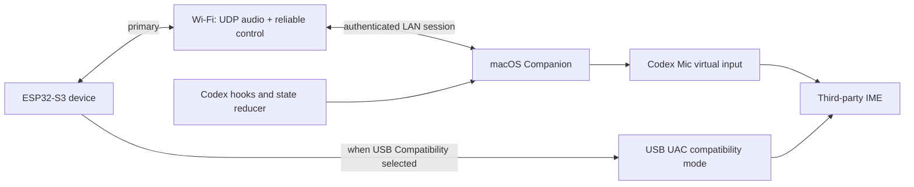

# Codex Companion V2: 混合无线与自助连接设计

## 目标与已确认决策

本版本把设备从“需要开发者通过终端配对和维护的原型”升级为可自助使用的桌面设备。

- 默认日常模式：Wi-Fi 承载语音、Codex 状态、额度、审批和控制。
- 兼容模式：USB Audio Class（UAC）输入，用于只接受物理/USB 音频设备的第三方输入法。
- BLE 不再是默认音频链路；仅用于首次发现、可选的配网协助和网络故障后的找回。
- Wi-Fi 密码通过设备临时热点的手机/Mac 配网页输入；圆屏显示二维码、一次性口令、状态和确认，不承载长密码输入。
- 用户可在设备连接中心触摸选择附近的 Mac、查看状态、配对、切换音频模式、重新连接和解绑。
- 不针对豆包、腾讯、讯飞等输入法编写品牌判断，也不读写其私有配置。

## 关键约束与边界

### 硬件

ESP32-S3-Touch-LCD-1.85B 具有 2.4 GHz Wi-Fi、Bluetooth 5 LE、双麦、ES7210/ES8311 和 ESP32-S3 原生 USB Type-C；其 USB D-/D+ 对应 GPIO19/GPIO20。[Waveshare 硬件资料](https://docs.waveshare.net/ESP32-S3-Touch-LCD-1.85B/)

ESP32-S3 的 USB-OTG 与 USB-Serial/JTAG 共用 PHY。因此 USB UAC 模式不得依赖同一 USB PHY 上的串口日志/烧录；设备必须在屏幕上清晰显示模式、提供退出/恢复路径，并在测试阶段使用替代调试方式。[Espressif USB Device 文档](https://docs.espressif.com/projects/esp-idf/en/v5.5/esp32s3/api-reference/peripherals/usb_device.html)

ESP32-S3 的蓝牙能力为 Bluetooth LE；本设计不把它包装为 Bluetooth Classic HFP 麦克风，也不把 BLE 当作标准蓝牙音频设备。

### 输入法兼容性

Wi-Fi 只改变设备到 Mac 的传输方式。若 `Codex Mic` 报告标准 CoreAudio `virtual`
transport，严格输入法仍可能在打开 IO 前将它过滤。Mac 驱动因此提供可回退的
USB 兼容 transport 元数据；这不改变 ESP32→Wi-Fi→Mac 音频路径，也不要求手持设备接线。
豆包输入法 0.9.4 已在 2026-07-17 实机验证该路径可识别并转成文字；不将此结果
泛化为所有应用的兼容承诺。

USB UAC 是这一限制的明确对照和兼容路径：Mac 将设备识别为标准 USB 输入设备，而不经过 `Codex Mic` 的音频注入。只有实际测试后，才可声称某输入法支持无线或 USB 模式。

### 安全基线

- 六位码只用作短认证字符串（SAS）的人机比对，绝不作为长期密钥或唯一认证因子。
- 配对交换并固定双方长期公钥，或使用首次实体访问得到的 32-byte 随机初始密钥；控制通道使用 TLS 1.3 的双向认证或公钥 pinning。
- UDP 音频使用 AEAD（首选 ChaCha20-Poly1305），包含会话随机 nonce、序号窗口、重放丢弃和每次会话的新派生密钥；HMAC 单独认证不足以保护音频保密性。
- Wi-Fi 凭据、主机密钥和会话状态进入受保护存储前，必须先完成 NVS encryption / key partition、Flash Encryption、Secure Boot、签名 OTA 的方案选择与实机验证。当前 `partitions.csv` 只有普通 `nvs` 分区，尚不满足此要求。
- “清除网络”和“解绑”分别删除 Wi-Fi 凭据、对应主机密钥和会话状态；诊断日志及导出不得包含密码、长期密钥、配对令牌或可重放的音频包。

## 用户体验

### 连接中心

从主表盘下拉打开 `LINK CENTER`，包含三个页面。

| 页面 | 显示与操作 |
| --- | --- |
| 网络 | Wi-Fi 开关、SSID、信号、IP、网络延迟、重新连接、配置网络、清除网络 |
| 主机 | 扫描附近 Mac Companion、触摸选择主机、显示已配对主机、切换、解绑、重新扫描 |
| 音频 | `Wi-Fi Wireless`、`USB Compatibility`、`BLE Recovery` 三种状态及可用性、上次音频错误、麦克风电平 |

无法连接时主表盘显示 `LINK LOST`，连接中心仍可打开；音频模式和已配对主机不会被自动删除。

### 首次安装和配网

1. 未配网的设备显示 `SET UP WI-FI`、二维码和短期一次性口令，并启动 `Codex-Setup-XXXX` SoftAP。
2. 用户用手机或 Mac 连入该热点并打开配网页；页面扫描并选择 Wi-Fi、输入密码。
3. 配网页通过 ESP-IDF provisioning 的安全会话提交凭据；设备在屏幕上显示扫描、连接、失败原因或成功。
4. 设备连网后使用 mDNS 查询附近的 Companion 广播，连接中心列出候选 Mac。
5. 用户在设备上点选一台 Mac，设备与 Mac 同时显示六码；设备长按 1.5 秒且 Mac 确认后才完成密钥绑定。
6. 若 mDNS 发现被企业网、访客网或 AP client isolation 阻断，用户在设备连接中心选择 `BLE RECOVERY PAIRING`；Mac Companion 的“等待配对”页面扫描并选择该设备，双方显示同一 SAS 并确认。经已加密的 BLE 恢复通道传递主机端点和长期公钥绑定，随后 Wi-Fi 仅连接已绑定身份。BLE 不传日常音频。

采用 SoftAP 是为了让没有预装手机 App 的用户也能完成自助配置。ESP-IDF 的 provisioning 支持 SoftAP+HTTP 和 BLE 两种传输以及认证加密会话；本项目将 SoftAP 作为默认 UX，BLE 仅为可选恢复路径。[Espressif Wi-Fi Provisioning](https://docs.espressif.com/projects/esp-idf/en/v5.5.2/esp32/api-reference/provisioning/wifi_provisioning.html)

### 日常语音

1. 设备已连接 Wi-Fi 和已选 Mac 时，用户按住 BOOT 进入本地 listening 动画。
2. 设备立即显示明显的波纹和音量电平；提示音仅在麦克风门打开前播放。
3. Mac Companion 收到 PTT，按用户的通用快捷键配置启动当前输入法语音功能。
4. Wi-Fi 音频帧写入 `Codex Mic`；松开 BOOT 后发送尾音、释放/触发停止快捷键并恢复状态。
5. 驱动默认使用已实机验证的严格输入法兼容标识；若目标应用仍不打开
   `Codex Mic` IO，连接中心才提供真实 USB UAC 备用，不伪造录音成功。

## 架构

### Wi-Fi transport

The following are protocol requirements, not claims of an already implemented network stack.

- First-release audio uses 16 kHz / 16-bit / mono PCM, 20 ms frames (640 bytes before encryption), an explicit maximum UDP payload, session ID and monotonically increasing frame sequence. This avoids codec-state failures while Wi-Fi bandwidth is sufficient. ADPCM is an optional later optimization and must retain independent state per packet.
- Jitter buffer, packet-loss concealment, late-frame drop threshold, audio-level sampling interval and every latency measurement point are fixed in the implementation plan before coding. Audio reports loss, late frames and estimated one-way delay to the connection center.
- Control uses a reliable bidirectional channel (WebSocket over TLS after pairing, or an equivalent authenticated reliable channel). It carries PTT edges, state updates, quotas, prompts, approvals, audio diagnostics, ACKs and heartbeats.
- Audio and control use independent queues, so state traffic cannot delay audio and audio bursts cannot prevent PTT release/approval messages.
- The authenticated pairing identity establishes the control channel and derives each audio session's AEAD key; sequence/replay protection remains mandatory on both transports.
- mDNS is discovery only, never authorization. The host accepts no audio/control before pairing.

### Pairing and identities

- The Companion advertises a local mDNS service only when user discovery is enabled.
- Candidate list entries show user-selected host name, transport reachability and pairing state; device IDs are not exposed as the main UI identifier.
- Pairing needs physical/user presence: user chooses host on device, checks the same six-digit SAS on both screens, then confirms on both ends. The device uses a long press for final confirmation.
- When mDNS cannot reach the device, BLE Recovery Pairing is the supported fallback: the Mac scans the device, user chooses it in Companion, both sides compare SAS, and only the encrypted recovery session transfers the host endpoint plus the long-lived public-key binding. A URI, if shown for diagnostics, is only untrusted candidate information and can never silently replace an existing key.
- Store long-lived per-host keys only after the security baseline is enabled: encrypted NVS on ESP32 and Keychain on macOS. A device has one active primary host; switching host is explicit and leaves the former identity stored only if user chooses “keep as backup”.
- Unpair deletes the corresponding key on both sides. Pairing timeout, wrong code or network change leaves no partial active host.

### USB compatibility mode

- `USB Compatibility` exposes an input-only standard UAC microphone, with the existing physical microphone source.
- Entering or leaving this mode is a controlled state machine: user selects mode -> UI shows `PREPARING USB MIC` -> device reboots -> UAC firmware/runtime re-enumerates -> Companion verifies VID/PID/serial and system routing -> UI shows ready or a specific failure. It is not an in-place toggle.
- The state machine must preserve the BOOT + power-on recovery flashing path and must never burn a permanent USB PHY-selection eFuse as part of normal product setup. If UAC enumeration fails, user can return to the recovery flashing path rather than becoming trapped in an unusable USB mode.
- It does not start the Wi-Fi audio gateway or `Codex Mic` audio feed for that session.
- Wi-Fi state/approval synchronization may remain connected when radio is available. If it is absent, UAC still captures audio but PTT/shortcut automation is unavailable unless a separately validated HID control path is added; raw Fn emulation is not treated as a standard USB HID capability.
- Companion identifies the UAC device by VID/PID/serial. Before PTT it verifies enumeration, temporarily routes the system input to it, waits for confirmation, and restores the previous input after PTT. It reports separately: not enumerated, route failure, and input-method rejection.
- On entering the mode, UI explains that Type-C is now audio, not flash/log transport; it offers a reboot-to-exit action and safe recovery path.
- USB UAC and its input format are verified against macOS Audio MIDI Setup, system recording, and each target IME before compatibility is claimed.

### Codex status synchronization

Codex Hook events continue to write to a local inbox owned by a login-started Companion agent. The visible macOS app is a configuration and diagnostics client; closing its window must not stop Wi-Fi, PTT, audio routing or hook processing. The state reducer pushes the latest effective state over the reliable Wi-Fi control channel and replays it after reconnect.

| Hook | Effective state |
| --- | --- |
| SessionStart | session starting / idle |
| UserPromptSubmit | working |
| PreToolUse | writing for file-mutating tools; running for other tools |
| PostToolUse success | working |
| PostToolUse explicit failure | error |
| PermissionRequest | approval required |
| Stop | completed or error |

`writing` and `running` require new protocol identifiers and corresponding firmware animations; they will not be silently collapsed after V2 is implemented.

State messages carry `sessionID`, `turnID`, monotonic revision and expiry. A reconnect can replay only the current unexpired session state. Approval actions carry one-time action IDs; before a Mac click, the agent rechecks the Accessibility element, option identity and risk class. Free text, Other, secrets, changed UI structures and expired actions remain on the Mac.

## Failure behavior

| Failure | Required behavior |
| --- | --- |
| Wi-Fi unavailable | keep local UI responsive; stop/reject PTT audio safely; show Link Lost; expose BLE recovery, manual pairing URI and configure-network paths |
| Wi-Fi drops during PTT | stop gateway, release synthesized keys, restore microphone/input source, show voice error; never leave a modifier held |
| Mac sleeps or Companion exits | device shows host unavailable; no stale approval action; resumes only after a new authenticated session |
| Pairing fails | do not save host key; display actionable reason and retry option |
| UDP loss/jitter | conceal bounded loss, report rate in connection center; control remains responsive |
| USB UAC unavailable | remain in Wi-Fi mode; present diagnostics instead of switching system defaults silently |
| Input method rejects virtual device | do not inject text; present USB compatibility suggestion and retain user shortcut profile |

## Implementation order

1. Establish secure storage, boot/OTA policy and recovery flashing procedure before persisting credentials or keys.
2. Add transport abstraction and event/state replay without changing current BLE path; retain BLE as regression reference.
3. Implement SoftAP provisioning with per-physical-trigger random credentials, Security 2 (or documented Security 1 fallback), QR/one-time code, 2.4 GHz-only handling, Wi-Fi persistence, mDNS discovery, manual pairing URI and touch connection center.
4. Implement authenticated Wi-Fi control; migrate quotas, state, approvals and PTT edges; split the login-started agent from GUI.
5. Implement Wi-Fi UDP PCM audio gateway with AEAD, loss/latency diagnostics and `Codex Mic` as the wireless sink.
6. Implement and validate USB UAC compatibility mode, reboot/re-enumeration, host routing and recovery.
7. Add writing/running state protocol identifiers and richer animations.
8. Run user-facing setup, reconnection, security and compatibility acceptance testing.

## Acceptance criteria

- A first-time user can configure Wi-Fi, choose a Mac, pair with dual confirmation, reconnect and unpair without terminal commands.
- Wi-Fi state updates reach device P95 <= 250 ms on the same LAN; device-to-Mac first audio packet P95 <= 100 ms; audio input start is measured separately for each IME.
- A Wi-Fi loss during PTT always restores shortcut and microphone routing within 2 seconds and leaves no key pressed.
- Reboot, sleep/wake, host switch, wrong pairing code and 100 repeated PTT sessions have automated/state-machine coverage.
- SoftAP brute force/timeout, malicious UDP replay/reordering, mDNS spoofing, macOS firewall/local-network denial, AP isolation, agent restart, GUI close, USB re-enumeration and UAC-to-flash recovery each have an explicit test.
- USB UAC is exposed as a standard macOS input device and has one real recording validation plus separate validation in each target input method.
- Doubao Input Method 0.9.4 wireless capture from `Codex Mic` is physically validated on 2026-07-17 with USB-compatible transport metadata; USB-UAC compatibility remains a separate, unvalidated claim until a real USB session succeeds.

## Out of scope for V2

- Brand-specific input method SDKs, private preferences or direct text injection.
- Pretending ESP32-S3 BLE is a standard Bluetooth HFP/BLE Audio microphone.
- Cloud relay or Internet-based microphone transport; this design is LAN-only.
- Multi-user simultaneous pairing.
